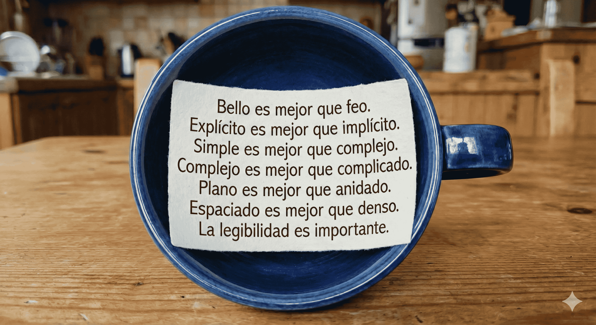

<!-- .slide: id="titulo" -->

# Nadie nada nunca

**PyDay Hurlingham**

**29 de Noviembre 2025**

---

<!-- .slide: data-transition="none" -->

### Sasha

Líder Técnico en Mercado Libre 

*IT Staff || Financial Planning & Analysis*

--

<!-- .slide: data-transition="none" -->

### Sasha

TL en **MELI**

*IT Staff || Financial Planning & Analysis*

--

NOTES:
Acá tengo que mencionar un par de cosas de que me interesa y que motiva esta charla

--


--

<iframe width="560" height="315" src="https://www.youtube-nocookie.com/embed/OMPfEXIlTVE?si=pqTo6xzKa1qfn5us" title="Nothing is Something" frameborder="0" allow="accelerometer; autoplay; clipboard-write; encrypted-media; gyroscope; picture-in-picture; web-share" referrerpolicy="strict-origin-when-cross-origin" allowfullscreen></iframe> 

[Nothing is Something](https://www.youtube.com/watch?v=OMPfEXIlTVE) de Sandi Metz


NOTES:
Hay demasiadas sutilezas en esta presentacion y muchas particularidades que me llevaron bastante tiempo entenderlas y más que entenderlas,internalizarlas y ver como podia utilizarlas en mi dia a dia.

---


<div style="display: flex; flex-direction: column; align-items: center; justify-content: center; height: 100%; gap: 20px;">

<div style="display: flex; flex-direction: column; width: 60%; gap: 5%;">

<div style="background-color: #4CAF50; height: 20%; border: 2px solid #000; display: flex; align-items: center; justify-content: center;">
<h3 style="margin: 0; color: #000; visibility: hidden;"><em>Buscando</em> la Abstracción</h3>
</div>

<div style="background-color: #4CAF50; height: 20%; border: 2px solid #000; display: flex; align-items: center; justify-content: center;">
<h3 style="margin: 0; color: #000; visibility: hidden;"><em>Centrado</em> en los Mensajes</h3>
</div>

<div style="background-color: #4CAF50; height: 20%; border: 2px solid #000; display: flex; align-items: center; justify-content: center;">
<h3 style="margin: 0; color: #000; visibility: hidden"><em>Reacio</em> a los Condicionales</h3>
</div>

<div style="background-color: #4CAF50; height: 20%; border: 2px solid #000; display: flex; align-items: center; justify-content: center; margin-top: 30px;">
<h3 style="margin: 0; color: #000;"><em>Infectado</em> por Smalltalk </h3>
</div>

</div>
</div>


NOTES: 
Hay una particularidad en como la gente que programa en Smalltalk piensa el código orientado a objetos.

---

<!-- .slide: id="poo" -->

### Programación Orientada a Objetos (POO)

<div class="fragment">
<iframe width="560" height="315" src="https://www.youtube.com/embed/ioeMeQNEgL8?si=DMdhg2cY7f_SQlry" title="YouTube video player" frameborder="0" allow="accelerometer; autoplay; clipboard-write; encrypted-media; gyroscope; picture-in-picture; web-share" referrerpolicy="strict-origin-when-cross-origin" allowfullscreen></iframe>

[Programar (casi) sin condicionales](https://www.youtube.com/watch?v=ioeMeQNEgL8)

</div>

NOTES:

Voy a pasar rapido por un par de ideas que explico en mas detalle en esta charla pero que nos van a ayudar a sentar las bases para lo que sigue.

--

Definamos unas reglas para la Programación Orientada a Objetos.

1. Todo es un objeto 
<!-- .element: class="fragment" -->
2. Los objetos se comunican enviandose mensajes
<!-- .element: class="fragment" -->


NOTES:
La programacion orientada a objetos tiene dos simples ideas o reglas:
y con estas reglas podemos generar todo tipo de comportamientos complejos.

--

```python
objetoA = MiObjeto()
```

--

<!-- .slide: data-transition="none" -->
```python
objetoA = MiObjeto()
objetoB = MiOtroObjeto()
```
--

<!-- .slide: data-transition="none" -->
```python
objetoA = MiObjeto()
objetoB = MiOtroObjeto()

objetoA.mensaje(objetoB)
```

--

<!-- .slide: data-transition="none" -->
```python
objetoA = MiObjeto()
objetoB = MiOtroObjeto()

objetoA.mensaje(objetoB)

objetoB.otro_mensaje(1, "2", [True], None, objetoA)
```

NOTES:

Para que nos sirve esto? 
Para reducir el contexto de cada cosa que hacemos. Separar responsabilidades, etc

--

```python
class MiObjeto:
    def mensaje(self, otro_objeto):
        otro_objeto.otro_mensaje(42)
```

--

Analicemos una particularidad de Smalltalk para ver como conceptualizamos los objetos.

--

```python
str(1)
# => '1'
```

--

<!-- .slide: data-transition="none" -->

```python
(1).__str__()
# => '1'
```

--

```python
1 + 1
# => 2 
```

--

```python
(1).__add__(1)
# => 2 
```

--

```python
type(1)
# => int
```

--

```python
dir(int)
# => ['__abs__', '__add__', '__and__', '__bool__', 
# '__class__', ..., '__str__', '__sub__', ...]
``` 

NOTES:
Esto es lo que es real, esto es lo que esta detras de la sintaxis especial que tenemos en Python para trabajar con los objetos. Estamos mandando un mensaje a un objeto.

---

```python
1 == 1
# => True
```

--

```python
(1).__eq__(1)
# => True
```

--

```python
type(True)
# => bool
```

--

```python
dir(bool)
# => [ '__abs__', '__add__', '__and__', '__bool__', ...
#  '__ne__', '__neg__', '__new__', '__or__',
#  ... '__ror__',... '__rxor__',... '__xor__', ... ]
```

NOTES:

Lo extrano es que en Python exista una sintaxis especial para trabajar con los booleanos, pero lo tenemos tan naturalizado que no lo cuestionamos.

--

## A diferencia de Smalltalk, Python tiene una sentencia especial para trabajar con los booleanos

--

Las keywords de SmallTalk: 

> true, false, nil, self, super, thisContext

<div class="fragment">

Las keywords de Python:

```python [|5]
import keyword
print(keyword.kwlist)
# => ['False', 'None', 'True', 'and', 'as', 'assert', 'async', 
# 'await', 'break', 'class', 'continue', 'def', 'del', 'elif',
# 'else', 'except', 'finally', 'for', 'from', 'global', 'if', 
# 'import', 'in', 'is', 'lambda', 'nonlocal', 'not', 'or', 'pass', 
# 'raise', 'return', 'try', 'while', 'with', 'yield']
```
</div>

<small class="fragment">

[Wikipedia: SmallTalk Syntax](https://en.wikipedia.org/wiki/Smalltalk#Syntax) | 
[Python Keywords](https://docs.python.org/3/reference/lexical_analysis.html#keywords)
</small>

--

```python
if (1 == 1):
    print("Verdadero")
else:
    print("Falso")
```

NOTES: 
Esta es la manera en la que utilizamos esta sintaxis en Python y en muchos otros 
lenguajes de programacion.
Hay una expresion que se evalua y dependiendo de su valor se ejecuta un bloque de codigo u otro.

--

<!-- .slide: data-transition="none" -->

```python
if (True):
    print("Verdadero")
else:
    print("Falso")
```

--

<!-- .slide: data-transition="none" -->

```python
if ( truthy ):
    # Código a evaluar cuando es verdadero
else:
    # Código a evaluar cuando es falso
```

--

<!-- .slide: data-transition="none" -->

```python
if ( Objeto del cual conozco el tipo ):
    # Código que hace algo
else:
    # Código que hace otra cosa
```

NOTES:
Esto es un TypeCheck, y es algo que se no se hace en OO.

---

### Solo quiero pasarle un **mensaje** a los objetos.

NOTES:
No quiero tener que ver el tipo de objeto que estoy manejando. Y en 
base a eso decidir entre distintos comportamientos.

---

# El "if"

**es un facilitador**
<!-- .element: class="fragment" -->

NOTES:
Si venimos de lenguajes procedurales es parecería que es normal y razonable implementar largos condicionales (con if, switch, case, etc) 

Y la idea principal de Sandi es que la presencia de esta palabra hace facilita
que mantengamos nuestra manera de pensar de manera procedural. Y nos impide aprender y a aprovechar el poder de la Programación Orientada a Objetos.

---

### Sintaxis de "Envío de Mensajes" para True y False

--

```python
class Verdadero:
    @classmethod
    def si_verdadero(cls, bloque_de_codigo):
        bloque_de_codigo()

```

--

<!-- .slide: data-transition="none" -->

```python
class Verdadero:
    @classmethod
    def si_verdadero(cls, bloque_de_codigo):
        bloque_de_codigo()
        return cls
```

--

<!-- .slide: data-transition="none" -->

```python [7-9]
class Verdadero:
    @classmethod
    def si_verdadero(cls, bloque_de_codigo):
        bloque_de_codigo()
        return cls

    @classmethod
    def si_falso(cls, bloque_de_codigo):
        return cls
```

--

```python
class Verdadero:
    @classmethod
    def si_verdadero(cls, bloque_de_codigo):
        bloque_de_codigo()
        return cls

    @classmethod
    def si_falso(cls, bloque_de_codigo):
        return cls
```

```python
class Falso:
    @classmethod
    def si_verdadero(cls, bloque_de_codigo):
        return cls

    @classmethod
    def si_falso(cls, bloque_de_codigo):
        bloque_de_codigo()
        return cls
```
<!-- .element: class="fragment" -->

--

```python
Verdadero.si_verdadero(lambda: print("Evalua este bloque"))
# => Evalua este bloque
```

```python
Verdadero.si_falso(lambda: print("Evalua este bloque"))
# =>
```
<!-- .element: class="fragment" -->

```python
Falso.si_verdadero(lambda: print("Evalua este bloque"))
# =>
```
<!-- .element: class="fragment" -->

```python
Falso.si_falso(lambda: print("Evalua este bloque"))
# => Evalua este bloque
```
<!-- .element: class="fragment" -->

--

```python
if (1 == 1):
    print("Es verdadero")
else:
    print("Es falso")
# => Es verdadero
```    

```python
(1 == 1).si_verdadero(lambda: print("Es verdadero"))
        .si_falso(lambda: print("Es falso"))
# => Es verdadero
```    
<!-- .element: class="fragment" -->

--

```python
if (1 == 2):
    print("Es verdadero")
else:
    print("Es falso")
# => Es falso
```    

```python
(1 == 2).si_verdadero(lambda: print("Es verdadero"))
        .si_falso(lambda: print("Es falso"))
# => Es falso
```    
<!-- .element: class="fragment" -->

--

### No queremos cambiar Python

--

<!-- .slide: data-transition:"none" -->

### Quiero que cambiemos nuestra manera de pensar

NOTES:
Solo queremos cambiar nuestra manera de pensar.
Es una invitación a pensar en como se diseñamos nuestro código

--

<!-- .slide: id="no-existiese-el-if" -->

**¿Qué pasaría si no existiera la sentencia `"if"`?**

---


<div style="display: flex; flex-direction: column; align-items: center; justify-content: center; height: 100%; gap: 20px;">

<div style="display: flex; flex-direction: column; width: 60%; gap: 5%;">

<div style="background-color: #4CAF50; height: 20%; border: 2px solid #000; display: flex; align-items: center; justify-content: center;">
<h3 style="margin: 0; color: #000; visibility: hidden;"><em>Buscando</em> la Abstracción</h3>
</div>

<div style="background-color: #4CAF50; height: 20%; border: 2px solid #000; display: flex; align-items: center; justify-content: center;">
<h3 style="margin: 0; color: #000; visibility: hidden;"><em>Centrado</em> en los Mensajes</h3>
</div>

<div style="background-color: #4CAF50; height: 20%; border: 2px solid #000; display: flex; align-items: center; justify-content: center;">
<h3 style="margin: 0; color: #000; visibility: hidden"><em>Reacio</em> a los Condicionales</h3>
</div>

<div style="background-color: #4CAF50; height: 20%; border: 2px solid #000; display: flex; align-items: center; justify-content: center; margin-top: 30px;">
<h3 style="margin: 0; color: #000;"><em>Infectado</em> por Smalltalk </h3>
</div>

</div>
</div>

--

<!-- .slide: data-transition="none" -->

<div style="display: flex; flex-direction: column; align-items: center; justify-content: center; height: 100%; gap: 20px;">

<div style="display: flex; flex-direction: column; width: 60%; gap: 5%;">

<div style="background-color: #4CAF50; height: 20%; border: 2px solid #000; display: flex; align-items: center; justify-content: center;">
<h3 style="margin: 0; color: #000; visibility: hidden;"><em>Buscando</em> la Abstracción</h3>
</div>

<div style="background-color: #4CAF50; height: 20%; border: 2px solid #000; display: flex; align-items: center; justify-content: center;">
<h3 style="margin: 0; color: #000; visibility: hidden;"><em>Centrado</em> en los Mensajes</h3>
</div>

<div style="background-color: #4CAF50; height: 20%; border: 2px solid #000; display: flex; align-items: center; justify-content: center;">
<h3 style="margin: 0; color: #000;"><em>Reacio</em> a los Condicionales</h3>
</div>

<div style="background-color: #4CAF50; height: 20%; border: 2px solid #000; display: flex; align-items: center; justify-content: center; margin-top: 30px;">
<h3 style="margin: 0; color: #000;"><em>Infectado</em> por Smalltalk </h3>
</div>

</div>
</div>

--

```python
Biblioteca.buscar("Los Sorias")
# =>  <__main__.Libro at 0x7f0f49464d70>
```

```python
Biblioteca.buscar("")
# => None
```
<!-- .element: class="fragment" -->

NOTES:
Veamos un caso terrible

--

```python [1|1-3|3-6|5]
ids = ["Los Sorias", "", "Ocio"]

libros = [ Biblioteca.buscar(id) for id in ids ]
# => [<__main__.Libro object at 0x7f0f4bf35940> id:Los Sorias,
# None,
# <__main__.Libro object at 0x7f0f48e10190> id:Ocio]
```

```python [|3]
for libro in libros:
    print(libro.autor)
# => AttributeError: 'NoneType' object has no attribute 'autor'
```
<!-- .element: class="fragment" -->

--

Hay veces que **None** *"es nada"*.

--

```python [|2|5-6]
libros = [ libro for id in ids 
           if (libro := Biblioteca.buscar(id)) 
         ]
# => [
# <__main__.Libro object at 0x7f0f4bf35940> id:Los Sorias,
# <__main__.Libro object at 0x7f0f48e10190> id:Ocio
#    ]
```

--

Pero si le pasamos un mensaje a **None**,

entonces *"es algo"*.
<!-- .element: class="fragment" -->

--

¿Y qué pasa si quiero manejar ese caso?

```python [9]
ids = ["Los Sorias", "", "Ocio"]

libros = [ Biblioteca.buscar(id) for id in ids ]
# => [<__main__.Libro object at 0x7f0f4bf35940> id:Los Sorias,
# None,
# <__main__.Libro object at 0x7f0f48e10190> id:Ocio]

for libro in libros:
    print("Libro desconocido" if libro is None else libro.autor)
```
<!-- .element: class="fragment" -->

--

```python [9]
ids = ["Los Sorias", "", "Ocio"]

libros = [ Biblioteca.buscar(id) for id in ids ]
# => [<__main__.Libro object at 0x7f0f4bf35940> id:Los Sorias,
# None,
# <__main__.Libro object at 0x7f0f48e10190> id:Ocio]

for libro in libros:
    print(libro and libro.autor)
```

--

```python
"Libro desconocido" if libro is None else libro.autor
```

```python
if libro is None:
    return "Libro desconocido"
else:
    return libro.autor
```
<!-- .element: class="fragment" -->

--

```python
if libro is None:
    return "Libro desconocido"
else:
    return libro.autor
```

```python [1|2|4]
if ( Objeto del cual conozco el tipo ):
    # Código que hace algo
else:
    # Código que hace otra cosa
```
<!-- .element: class="fragment" -->

--

<div style="display: flex; justify-content: space-around; overflow: hidden;">
<div style="flex: 1 1 auto; padding: 3px;">

```python
if libro is None:
    return "Libro desconocido"
else:
    return libro.autor
```

</div>
<div style="flex: 1 1 auto; padding: 3px;">

```python [|2]
if ( Objeto del cual conozco el tipo ):
    # Código que hace algo
else:
    # Código que hace otra cosa
```

</div>
</div>

--

<!-- .slide: data-transition="none" -->

<div style="display: flex; justify-content: space-around; overflow: hidden;">
<div style="flex: 1 1 auto; padding: 3px;">

```python
if libro is None:
    return "Libro desconocido"
else:
    return libro.autor
```

</div>
<div style="flex: 1 1 auto; padding: 3px;">

```python [2|4]
if ( Objeto del cual conozco el tipo ):
    # Yo proveo el comportamiento
else:
    # Código que hace otra cosa
```

</div>
</div>

--

<!-- .slide: data-transition="none" -->

<div style="display: flex; justify-content: space-around; overflow: hidden;">
<div style="flex: 1 1 auto; padding: 3px;">

```python
if libro is None:
    return "Libro desconocido"
else:
    return libro.autor
```

</div>
<div style="flex: 1 1 auto; padding: 3px;">

```python [4]
if ( Objeto del cual conozco el tipo ):
    # Yo proveo el comportamiento
else:
    # Le envío un mensaje al objeto
```

</div>
</div>

NOTES:
Esto es abosolutamente terrible y el problema central es que los condicionales 
se multiplican.

--

<!-- .slide: id="condicionales" -->

## LOS CONDICIONALES

<h1 style="font-size: 3em; color: #e74c3c;" class="fragment">SE MULTIPLICAN</h1>

--

<div style="position: relative; height: 600px; width: 100%;">

<!-- Snippet central - sin modificar -->
<div style="position: absolute; top: 50%; left: 50%; transform: translate(-50%, -50%);">

```python
libro = Biblioteca.buscar(id)
"Libro desconocido" if libro is None else libro.autor
```

</div>

<!-- Primera transición - snippets en esquinas y parte superior -->
<div class="fragment">

<div style="position: absolute; top: 5%; left: 5%; transform: rotate(-15deg); opacity: 0.6; font-size: 0.7em;">

```python
libro = Biblioteca.buscar(id)
"Libro desconocido" if libro is None else libro.autor
```

</div>

<div style="position: absolute; top: 5%; right: 5%; transform: rotate(12deg); opacity: 0.6; font-size: 0.7em;">

```python
libro = Biblioteca.buscar(id)
"Libro desconocido" if libro is None else libro.autor
```

</div>

<div style="position: absolute; top: 30%; left: 2%; transform: rotate(-20deg); opacity: 0.6; font-size: 0.7em;">

```python
libro = Biblioteca.buscar(id)
"Libro desconocido" if libro is None else libro.autor
```

</div>

<div style="position: absolute; top: 30%; right: 2%; transform: rotate(18deg); opacity: 0.6; font-size: 0.7em;">

```python
libro = Biblioteca.buscar(id)
"Libro desconocido" if libro is None else libro.autor
```

</div>

</div>

<!-- Segunda transición - snippets en parte inferior y lados -->
<div class="fragment">

<div style="position: absolute; bottom: 5%; left: 5%; transform: rotate(10deg); opacity: 0.6; font-size: 0.7em;">

```python
libro = Biblioteca.buscar(id)
"Libro desconocido" if libro is None else libro.autor
```

</div>

<div style="position: absolute; bottom: 5%; right: 5%; transform: rotate(-15deg); opacity: 0.6; font-size: 0.7em;">

```python
libro = Biblioteca.buscar(id)
"Libro desconocido" if libro is None else libro.autor
```

</div>

<div style="position: absolute; bottom: 30%; left: 2%; transform: rotate(20deg); opacity: 0.6; font-size: 0.7em;">

```python
libro = Biblioteca.buscar(id)
"Libro desconocido" if libro is None else libro.autor
```

</div>

<div style="position: absolute; bottom: 30%; right: 2%; transform: rotate(-12deg); opacity: 0.6; font-size: 0.7em;">

```python
libro = Biblioteca.buscar(id)
"Libro desconocido" if libro is None else libro.autor
```

</div>

</div>

<!-- Mensaje "Libro desconocido" aproximándose en 3 transiciones -->
<div class="fragment" style="position: absolute; top: 20%; left: 20%; font-size: 1em; color: #e74c3c; font-weight: bold; opacity: 0.7; font-family: monospace; background: rgba(0, 0, 0, 0.7); padding: 10px; border-radius: 5px;">
"Libro desconocido"
</div>

<div class="fragment" style="position: absolute; top: 35%; left: 35%; font-size: 2em; color: #e74c3c; font-weight: bold; opacity: 0.85; font-family: monospace; background: rgba(0, 0, 0, 0.75); padding: 15px; border-radius: 8px;">
"Libro desconocido"
</div>

<div class="fragment" style="position: absolute; top: 50%; left: 50%; transform: translate(-50%, -50%); font-size: 4em; color: #e74c3c; font-weight: bold; opacity: 1; text-shadow: 0 0 20px rgba(231, 76, 60, 0.8); font-family: monospace; background: rgba(0, 0, 0, 0.85); padding: 20px; border-radius: 10px;">
"Libro desconocido !!!"
</div>

</div>

--

<!-- .slide: id="shotgun-surgery" -->

## ¿Qué pasa si quiero cambiar ese valor?

--

  

--

<div style="display: flex; flex-direction: column; align-items: center; justify-content: center; height: 100%; gap: 20px;">

<div style="display: flex; flex-direction: column; width: 60%; gap: 5%;">

<div style="background-color: #4CAF50; height: 20%; border: 2px solid #000; display: flex; align-items: center; justify-content: center;">
<h3 style="margin: 0; color: #000; visibility: hidden;"><em>Buscando</em> la Abstracción</h3>
</div>

<div style="background-color: #4CAF50; height: 20%; border: 2px solid #000; display: flex; align-items: center; justify-content: center;">
<h3 style="margin: 0; color: #000; visibility: hidden;"><em>Centrado</em> en los Mensajes</h3>
</div>

<div style="background-color: #4CAF50; height: 20%; border: 2px solid #000; display: flex; align-items: center; justify-content: center;">
<h3 style="margin: 0; color: #000;"><em>Reacio</em> a los Condicionales</h3>
</div>

<div style="background-color: #4CAF50; height: 20%; border: 2px solid #000; display: flex; align-items: center; justify-content: center; margin-top: 30px;">
<h3 style="margin: 0; color: #000;"><em>Infectado</em> por Smalltalk </h3>
</div>

</div>
</div>

--

<!-- .slide: data-transition="none" -->

<div style="display: flex; flex-direction: column; align-items: center; justify-content: center; height: 100%; gap: 20px;">

<div style="display: flex; flex-direction: column; width: 60%; gap: 5%;">

<div style="background-color: #4CAF50; height: 20%; border: 2px solid #000; display: flex; align-items: center; justify-content: center;">
<h3 style="margin: 0; color: #000; visibility: hidden;"><em>Buscando</em> la Abstracción</h3>
</div>

<div style="background-color: #4CAF50; height: 20%; border: 2px solid #000; display: flex; align-items: center; justify-content: center;">
<h3 style="margin: 0; color: #000;"><em>Centrado</em> en los Mensajes</h3>
</div>

<div style="background-color: #4CAF50; height: 20%; border: 2px solid #000; display: flex; align-items: center; justify-content: center;">
<h3 style="margin: 0; color: #000;"><em>Reacio</em> a los Condicionales</h3>
</div>

<div style="background-color: #4CAF50; height: 20%; border: 2px solid #000; display: flex; align-items: center; justify-content: center; margin-top: 30px;">
<h3 style="margin: 0; color: #000;"><em>Infectado</em> por Smalltalk </h3>
</div>

</div>
</div>

--


<div style="display: flex; justify-content: space-around; overflow: hidden;">
<div style="flex: 1 1 auto; padding: 10px;">

```python
if libro is None:
    return "Libro desconocido"
else:
    return libro.autor
```

</div>
<div style="flex: 1 1 auto; padding: 10px;">

```python
if ( Objeto del cual conozco el tipo ):
    # Yo proveo el comportamiento
else:
    # Le envío un mensaje al objeto
```

</div>
</div>

--

```python [|4]
if libro is None:
    return "Libro desconocido"
else:
    return libro.autor
```

NOTES:
No quiero saber todo el tiempo si el objeto es None o no, solo quiero 
mandarle un mensaje

--

```python
class Libro:
    @property
    def autor(self):
        ...
```

```python
class NoneType:
    # No entiende el mensaje "autor"
```
<!-- .element: class="fragment" -->

NOTES:
El problema está en que unas veces recibimos el objeto Libro y otras veces NoneType que no entiende el mensaje autor.

--

<!-- .slide: data-transition="none" -->

```python
class Libro:
    @property
    def autor(self):
        ...
```

```python
class ???:
    @property
    def autor(self):
        return "Libro desconocido"
```
<!-- .element: class="fragment" -->

--

<!-- .slide: data-transition="none" -->

```python
class Libro:
    @property
    def autor(self):
        ...
```

```python
class LibroDesconocido:
    @property
    def autor(self):
        return "Libro desconocido"
```

--

```python [4]
ids = ["Los Sorias", "", "Ocio"]

libros = [ 
    Biblioteca.buscar(id)
    for id in ids ]
# => [
# <__main__.Libro object at 0x7f0f49464ec0> id:Los Sorias,
# None,
# <__main__.Libro object at 0x7f0f48e11a90> id:Ocio
# ]

for libro in libros:
    if libro is None:
        print("Libro desconocido")
    else:
        print(libro.autor)
```

--

<!-- .slide: data-transition="none" -->

```python [4|4,8]
ids = ["Los Sorias", "", "Ocio"]

libros = [ 
    Biblioteca.buscar(id) or LibroDesconocido() 
    for id in ids ]
# => [
# <__main__.Libro object at 0x7f0f49464ec0> id:Los Sorias,
# None,
# <__main__.Libro object at 0x7f0f48e11a90> id:Ocio
# ]

for libro in libros:
    if libro is None:
        print("Libro desconocido")
    else:
        print(libro.autor)
```

--

<!-- .slide: data-transition="none" -->

```python [8|4,13|13-16|13-15]
ids = ["Los Sorias", "", "Ocio"]

libros = [ 
    Biblioteca.buscar(id) or LibroDesconocido() 
    for id in ids ]
# => [
# <__main__.Libro object at 0x7f0f49464ec0> id:Los Sorias,
# <__main__.LibroDesconocido at 0x7f0f49464c20>,
# <__main__.Libro object at 0x7f0f48e11a90> id:Ocio
# ]

for libro in libros:
    if libro is None:
        print("Libro desconocido")
    else:
        print(libro.autor)
```

NOTES:
¿Es mejor este codigo?
- tenemos una nueva dependencia
- todavía tenemos un condicional
- pero ya no somos responsables del comportamiento

--

<!-- .slide: data-transition="none" -->

```python [12-13]
ids = ["Los Sorias", "", "Ocio"]

libros = [ 
    Biblioteca.buscar(id) or LibroDesconocido() 
    for id in ids ]
# => [
# <__main__.Libro object at 0x7f0f49464ec0> id:Los Sorias,
# <__main__.LibroDesconocido at 0x7f0f49464c20>,
# <__main__.Libro object at 0x7f0f48e11a90> id:Ocio
# ]

for libro in libros:
        print(libro.autor)
```

--

<!-- .slide: data-transition="none" -->

```python [12-13]
ids = ["Los Sorias", "", "Ocio"]

libros = [ 
    Biblioteca.buscar(id) or LibroDesconocido() 
    for id in ids ]
# => [
# <__main__.Libro object at 0x7f0f49464ec0> id:Los Sorias,
# <__main__.LibroDesconocido at 0x7f0f49464c20>,
# <__main__.Libro object at 0x7f0f48e11a90> id:Ocio
# ]

for libro in libros:
    print(libro.autor)
```

--

```python [12-17]
ids = ["Los Sorias", "", "Ocio"]

libros = [ 
    Biblioteca.buscar(id) or LibroDesconocido() 
    for id in ids ]
# => [
# <__main__.Libro object at 0x7f0f49464ec0> id:Los Sorias,
# <__main__.LibroDesconocido at 0x7f0f49464c20>,
# <__main__.Libro object at 0x7f0f48e11a90> id:Ocio
# ]

for libro in libros:
    print(libro.autor)
# => 
# Alberto Laiseca
# Libro desconocido
# Fabián Casas
```


--

```python
class Libro:
    @property
    def autor(self):
        ...
```

```python [1]
class LibroDesconocido:
    @property
    def autor(self):
        return "Libro desconocido"
```
<!-- .element: class="fragment" -->

--

### Patrón del Objeto Nulo

*Null Object Pattern*
<!-- .element: class="fragment fade-out" -->


**'La Nada Activa'** 
<!-- .element: class="fragment" -->

--


```python [4]
ids = ["Los Sorias", "", "Ocio"]

libros = [ 
    Biblioteca.buscar(id) or LibroDesconocido() 
    for id in ids ]

for libro in libros:
    print(libro.autor)
# => 
# Alberto Laiseca
# Libro desconocido
# Fabián Casas
```

--

Tenemos que preferir conocer un objeto que duplicar comportamiento.

--

Tenemos que preferir conocer **pocos** objetos.

--

<div style="position: relative; height: 600px; width: 100%;">

<!-- Snippet central - sin modificar -->
<div style="position: absolute; top: 50%; left: 50%; transform: translate(-50%, -50%);">

```python
libro = Biblioteca.buscar(id) or LibroDesconocido()
libro.autor
```

</div>

<!-- Primera transición - snippets en esquinas y parte superior -->
<div class="fragment">

<div style="position: absolute; top: 5%; left: 5%; transform: rotate(-15deg); opacity: 0.6; font-size: 0.7em;">

```python
libro = Biblioteca.buscar(id) or LibroDesconocido()
libro.autor
```

</div>

<div style="position: absolute; top: 5%; right: 5%; transform: rotate(12deg); opacity: 0.6; font-size: 0.7em;">

```python
libro = Biblioteca.buscar(id) or LibroDesconocido()
libro.autor
```

</div>

<div style="position: absolute; top: 30%; left: 2%; transform: rotate(-20deg); opacity: 0.6; font-size: 0.7em;">

```python
libro = Biblioteca.buscar(id) or LibroDesconocido()
libro.autor
```

</div>

<div style="position: absolute; top: 30%; right: 2%; transform: rotate(18deg); opacity: 0.6; font-size: 0.7em;">

```python
libro = Biblioteca.buscar(id) or LibroDesconocido()
libro.autor
```

</div>

</div>

<!-- Segunda transición - snippets en parte inferior y lados -->
<div class="fragment">

<div style="position: absolute; bottom: 5%; left: 5%; transform: rotate(10deg); opacity: 0.6; font-size: 0.7em;">

```python
libro = Biblioteca.buscar(id) or LibroDesconocido()
libro.autor
```

</div>

<div style="position: absolute; bottom: 5%; right: 5%; transform: rotate(-15deg); opacity: 0.6; font-size: 0.7em;">

```python
libro = Biblioteca.buscar(id) or LibroDesconocido()
libro.autor
```

</div>

<div style="position: absolute; bottom: 30%; left: 2%; transform: rotate(20deg); opacity: 0.6; font-size: 0.7em;">

```python
libro = Biblioteca.buscar(id) or LibroDesconocido()
libro.autor
```

</div>

<div style="position: absolute; bottom: 30%; right: 2%; transform: rotate(-12deg); opacity: 0.6; font-size: 0.7em;">

```python
libro = Biblioteca.buscar(id) or LibroDesconocido()
libro.autor
```

</div>

</div>

<!-- Mensaje "Libro desconocido" aproximándose en 3 transiciones -->
<div class="fragment" style="position: absolute; top: 20%; left: 20%; font-size: 1em; color: #e74c3c; font-weight: bold; opacity: 0.7; font-family: monospace; background: rgba(0, 0, 0, 0.7); padding: 10px; border-radius: 5px;">
"LibroDesconocido"
</div>

<div class="fragment" style="position: absolute; top: 35%; left: 35%; font-size: 2em; color: #e74c3c; font-weight: bold; opacity: 0.85; font-family: monospace; background: rgba(0, 0, 0, 0.75); padding: 15px; border-radius: 8px;">
"LibroDesconocido"
</div>

<div class="fragment" style="position: absolute; top: 50%; left: 50%; transform: translate(-50%, -50%); font-size: 4em; color: #e74c3c; font-weight: bold; opacity: 1; text-shadow: 0 0 20px rgba(231, 76, 60, 0.8); font-family: monospace; background: rgba(0, 0, 0, 0.85); padding: 20px; border-radius: 10px;">
"LibroDesconocido ???"
</div>

</div>

--

```python
class Biblioteca:

    @staticmethod
    def buscar(id):
        ...
```

--


```python
class BibliotecaSegura:

    @staticmethod
    def buscar(id):
        return Biblioteca.buscar(id) or LibroDesconocido()
```

--

```python [2]
libros = [ 
    Biblioteca.buscar(id) or LibroDesconocido() 
    for id in ids ]
```

--

<!-- .slide: data-transition="none" -->

```python [2]
libros = [ 
    BibliotecaSegura.buscar(id) 
    for id in ids ]
```

--


```python [2|]
libros = [ 
    BibliotecaSegura.buscar(id) 
    for id in ids ]
# => [
# <__main__.Libro object at 0x7f0f49464ec0> id:Los Sorias,
# <__main__.LibroDesconocido at 0x7f0f49464c20>,
# <__main__.Libro object at 0x7f0f48e11a90> id:Ocio
# ]
```

```python
for libro in libros:
    print(libro.autor)
# => 
# Alberto Laiseca
# Libro desconocido
# Fabián Casas
```
<!-- .element: class="fragment" -->


---


<div style="display: flex; flex-direction: column; align-items: center; justify-content: center; height: 100%; gap: 20px;">

<div style="display: flex; flex-direction: column; width: 60%; gap: 5%;">

<div style="background-color: #4CAF50; height: 20%; border: 2px solid #000; display: flex; align-items: center; justify-content: center;">
<h3 style="margin: 0; color: #000; visibility: hidden;"><em>Buscando</em> la Abstracción</h3>
</div>

<div style="background-color: #4CAF50; height: 20%; border: 2px solid #000; display: flex; align-items: center; justify-content: center;">
<h3 style="margin: 0; color: #000;"><em>Centrado</em> en los Mensajes</h3>
</div>

<div style="background-color: #4CAF50; height: 20%; border: 2px solid #000; display: flex; align-items: center; justify-content: center;">
<h3 style="margin: 0; color: #000;"><em>Reacio</em> a los Condicionales</h3>
</div>

<div style="background-color: #4CAF50; height: 20%; border: 2px solid #000; display: flex; align-items: center; justify-content: center; margin-top: 30px;">
<h3 style="margin: 0; color: #000;"><em>Infectado</em> por Smalltalk </h3>
</div>

</div>
</div>

--

<!-- .slide: data-transition="none" -->

<div style="display: flex; flex-direction: column; align-items: center; justify-content: center; height: 100%; gap: 20px;">

<div style="display: flex; flex-direction: column; width: 60%; gap: 5%;">

<div style="background-color: #4CAF50; height: 20%; border: 2px solid #000; display: flex; align-items: center; justify-content: center;">
<h3 style="margin: 0; color: #000;"><em>Buscando</em> la Abstracción</h3>
</div>

<div style="background-color: #4CAF50; height: 20%; border: 2px solid #000; display: flex; align-items: center; justify-content: center;">
<h3 style="margin: 0; color: #000;"><em>Centrado</em> en los Mensajes</h3>
</div>

<div style="background-color: #4CAF50; height: 20%; border: 2px solid #000; display: flex; align-items: center; justify-content: center;">
<h3 style="margin: 0; color: #000;"><em>Reacio</em> a los Condicionales</h3>
</div>

<div style="background-color: #4CAF50; height: 20%; border: 2px solid #000; display: flex; align-items: center; justify-content: center; margin-top: 30px;">
<h3 style="margin: 0; color: #000;"><em>Infectado</em> por Smalltalk </h3>
</div>

</div>
</div>

--

NOTES:
Acá tengo que detallar que la charla de Sandi sigue con un ejemplo largo y que 
es ultra recomendable seguirlo

--

NOTES:
Pero vamos a detallar la Abstracción 

--


--



--

<!-- .slide: id="filosofia-nada" -->

### El Principio de la Utilidad del Vacío

**Tao Te Ching:**
> "Trabajamos con el ser, pero el no-ser es lo que usamos."
<!-- .element: class="fragment" -->

NOTES:
La abstracción se esconde en el espacio vacío (la ausencia de if)

---

--

<!-- .slide: id="monoides" -->

## Paralelo Funcional: Monoides

### El Objeto Nulo en Data Processing

* En el procesamiento de datos, la **Identidad Monoidal** es el "Null Object"
* Ejemplo Clásico: Si queremos appendear resultados de múltiples procesos

---

<!-- .slide: id="lista-vacia" -->

## La Lista Vacía y el DataFrame Vacío

* Si un proceso no encuentra datos ("Nada"), debe devolver la **Identidad**
* **Identidad:** Una lista vacía `[]` o un DataFrame vacío `pd.DataFrame()`
* **Beneficio:** Permite que el paso siguiente (concatenación) se ejecute sin if y sin errores

> **Nota:** Crear un DataFrame vacío puede ser más costoso que un simple if en loops muy rápidos. Es una compensación entre legibilidad/robustez y velocidad.

---

<!-- .slide: id="preguntas" -->

## ¡Preguntas!

**[Tu Contacto Principal / Twitter]**

---

<!-- .slide: id="gracias" -->

## Gracias

### Contacto y Redes

* **Email:** [Tu Email]
* **LinkedIn:** [Tu LinkedIn]
* ¡Hablemos de código!
